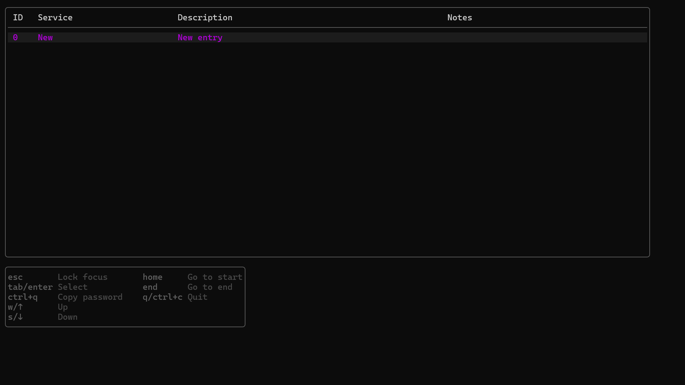
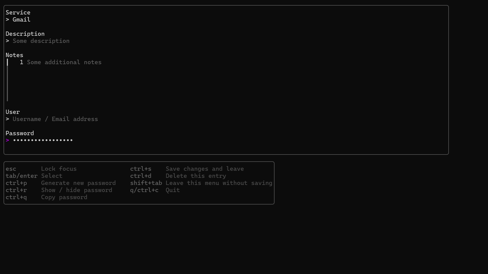

# PwdMan

This project resembles a _simplistic_ **terminal user interface** for managing _passwords_ written in [Go] using [Bubble Tea], [Bubbles], [Lip Gloss] and the [GO Windows DPAPI Wrapper] supporting both **_Windows_** and **_Linux_**. _MacOS_ support is not planned.

## Features

### Current features

-   🔐 Storing _passwords_ and _other credentials like emails_ locally and securing them using the [data protection API] on **Windows** and the [AES-GCM] symmetric cipher on **Linux**
-   🔑 Generating _cryptographically secure_ passwords of substantial length (10-20 characters) using [Go]'s [crypto/rand] package
-   Utilization of the [pwned passwords API] by [HaveIBeenPwned.com](https://haveibeenpwned.com) to ensure that passwords have never appeared in a data breach before _(currently only supported when generating new passwords, this feature will be expanded upon soon™)_
-   💻 Comprehensive _terminal UI_ using [Bubble tea] featuring colorful joys!

### Planned features (soon™) / ideas

-   Further integration of the [pwned passwords API]
-   Building a desktop GUI version using WebViews
-   Moving the project to C/C++ to learn these languages a little better

## Installation / Building

### Installation

If you want to _install PwdMan_ for your own use, just download it from the [Releases section] from this repo.

### Building

If you want to _build the source code_ yourself, clone the repo to your local machine and execute the appropriate `build` file (`build.bat` for _Windows_, `build.sh` for _Linux_).

Here is a step-by-step guide:

1. Clone the repo: `git clone https://github.com/m1ck6x/PwdMan.git`

2. Run:

    - `build.bat` _if your operating system is **Windows**_
    - `build.sh` _if your operating system is **Linux**_

3. You should find an _executable file_ within the `release/` folder

## Previews

Preview of the menu:

Preview of _PwdMan_ when editing an entry / account:

## License

[GNU AGPLv3](LICENSE)

## Third-party licenses & attributions

-   [Bubble tea], licensed under the [MIT License](https://github.com/charmbracelet/bubbletea/raw/main/LICENSE)

-   [Bubbles], licensed under the [MIT License](https://github.com/charmbracelet/bubbletea/raw/main/LICENSE)

-   [Lip Gloss], license under the [MIT License](https://github.com/charmbracelet/lipgloss/raw/master/LICENSE)

-   [GO Windows DPAPI Wrapper], licensed under the [MIT License](https://github.com/billgraziano/dpapi/raw/master/LICENSE)

[Go]: https://go.dev/
[data protection API]: https://wikipedia.org/wiki/Data_Protection_API
[AES-GCM]: https://wikipedia.org/wiki/Galois/Counter_Mode
[crypto/rand]: https://pkg.go.dev/crypto/rand
[pwned passwords API]: https://haveibeenpwned.com/API/v3#PwnedPasswords
[Releases section]: https://github.com/m1ck6x/pwdman/releases
[Bubble Tea]: https://github.com/charmbracelet/bubbletea
[Bubbles]: https://github.com/charmbracelet/bubbles
[Lip Gloss]: https://github.com/charmbracelet/lipgloss
[GO Windows DPAPI Wrapper]: https://github.com/billgraziano/dpapi
